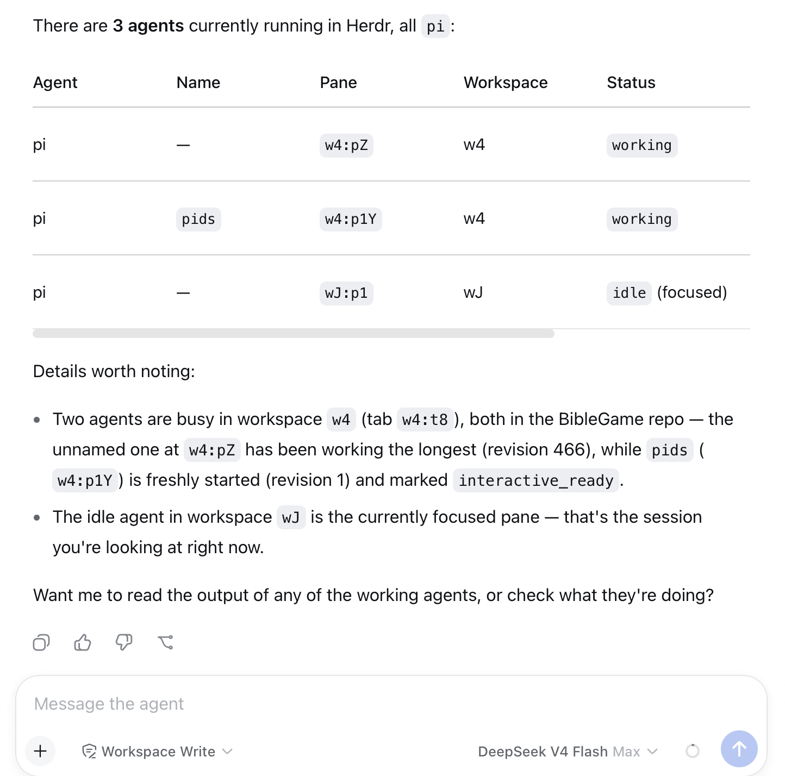

# herdr-bridge

A dsh plugin that bridges a [DeepSeek Harness](https://github.com/deepseek-ai/deepseek-harness) web session to [Herdr](https://herdr.dev), letting the dsh agent discover, start, prompt, and observe other agents (pi, claude, codex, ...) running under Herdr — all from inside the dsh web UI.



## Requirements

- dsh (npx `@deepseek-ai/dsh` or a local build) with the `web` profile
- Herdr running on the same machine (`herdr` CLI on PATH, socket at `~/.config/herdr/herdr.sock`)
- Node.js >= 20

## Install

From GitHub (published source):

```sh
dsh plugin --profile web add github:damozhang/dsh-herdr-bridge
```

From npm (once published):

```sh
dsh plugin --profile web add dsh-herdr-bridge
```

From a local checkout (development):

```sh
dsh plugin --profile web add /path/to/herdr-bridge
```

Then restart the dsh web server so the bundle is loaded. To update to a newer version, run `add` again with the same source (pnpm caches; `remove` first if you switch sources). For active development, link the local checkout — source edits take effect on the next server restart — and switch back to the GitHub source to validate what others will install.

## Starting dsh so Herdr integration works (important)

Herdr's own skill refuses to act when the agent process is not Herdr-managed: it checks `HERDR_ENV=1` in the environment and stops otherwise. The dsh web process must therefore run with `HERDR_ENV=1` set, otherwise the dsh agent will refuse to touch Herdr even though this plugin is installed.

### Option A — recommended: run dsh web inside a Herdr pane

Herdr automatically injects `HERDR_ENV=1` (and `HERDR_SOCKET_PATH`/`HERDR_PANE_ID`) into every pane it manages. Create a pane bound to your usual working directory and run:

```sh
npx @deepseek-ai/dsh web
```

The web server inherits the Herdr environment, the skill gate passes, and the server's own output stays observable in that pane.

### Option B — run in a plain terminal with exported environment

If you prefer the web server outside Herdr, export the markers first:

```sh
export HERDR_ENV=1
export HERDR_SOCKET_PATH="$HOME/.config/herdr/herdr.sock"
npx @deepseek-ai/dsh web
```

This satisfies the skill check but is less "native" than running inside a Herdr pane.

### Verify

Open the dsh web UI and ask the agent to `herdr_agent_list`. If it returns the live Herdr agents (with pane ids), the bridge is working. If the agent refuses with a Herdr environment error, the server was started without `HERDR_ENV=1`.

The plugin's tools also set `HERDR_ENV=1` and a default socket path on every spawned `herdr` CLI call, so tool execution itself is resilient; the process-level variable is what the skill gate checks.

## Tools

| Tool | Purpose |
|---|---|
| `herdr_agent_list` | List Herdr agents (pane id, status, cwd) to discover collaboration targets |
| `herdr_agent_start` | Create a workspace and start an agent (kind: pi, claude, codex, ...; optional model) |
| `herdr_agent_prompt` | Send a message to an agent by pane id, wait for completion, return its output |
| `herdr_delegate` | One-shot: start agent → submit task → wait → return output (optional cleanup) |
| `herdr_pane_run` | Run a shell command in any pane and read its output (optional match-wait) |
| `herdr_workspace_close` | Close a workspace to clean up its agents and panes |

## Examples

Ask the dsh web agent:

```
herdr_delegate: review /path/to/code with model opencode-go/deepseek-v4-pro
```

or compose primitives:

```
herdr_agent_list
herdr_agent_start pi in /path with model opencode-go/deepseek-v4-pro
herdr_agent_prompt <paneId> "implement feature X and run the tests"
herdr_workspace_close <workspaceId>
```

## Development

```sh
pnpm install        # pulls @deepseek-ai/dsh-tools
dsh plugin --profile web add /abs/path/to/this/repo
```

Schema notes: the dsh value-schema DSL is stricter than JSON Schema — `required` lives per-field, and `object` schemas must declare `additionalProperties` explicitly.

## License

MIT
